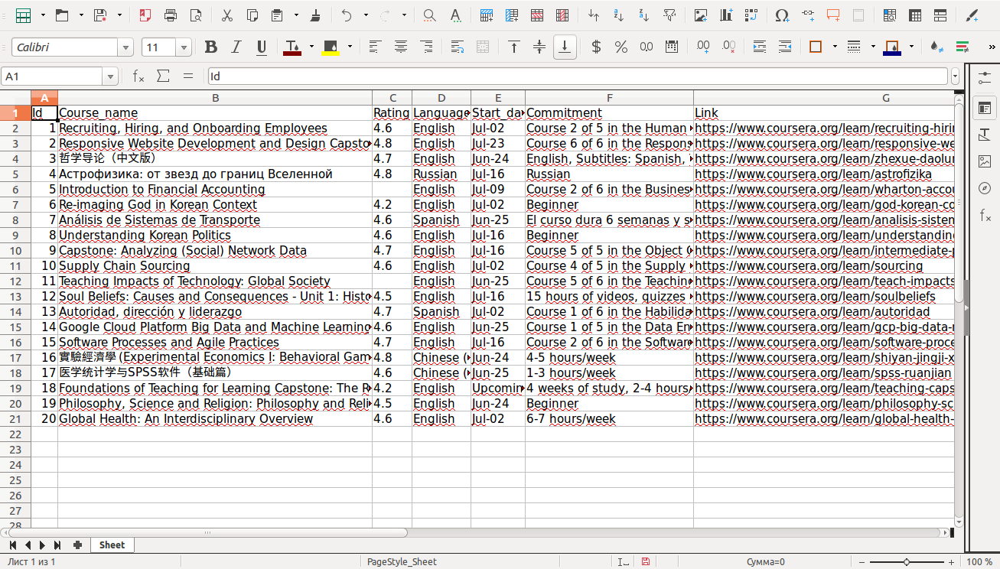

## Coursera Dump

---

### Descriptions
The script make parsing [Coursera](https://www.coursera.org) and get information about courses

+ We get .xml file with list [urls](https://www.coursera.org/sitemap~www~courses.xml)
+ We get course data to url:
    `course name`
    `rating`
    `language`
    `commitment`
+ And we write this data in .xlsx file
+ for script you need:
    [virtualenv](http://docs.python-guide.org/en/latest/dev/virtualenvs/)
    [requests](http://docs.python-requests.org/en/latest/)
    [openpyxl](https://pypi.org/project/openpyxl/)
    [beautifulsoup4](https://pypi.org/project/beautifulsoup4/) 


### Install libs

```bash
pip install -r requirements.txt  # or pip3 
```

### Sart script
```bash
python coursera.py
```

### Example result scrinshort



### Requirements

```bash
Python ver 3.5 (or higher)
```

---
## Project Goals

The code is written for educational purposes. Training course for web-developers - [DEVMAN.org](https://devman.org)
